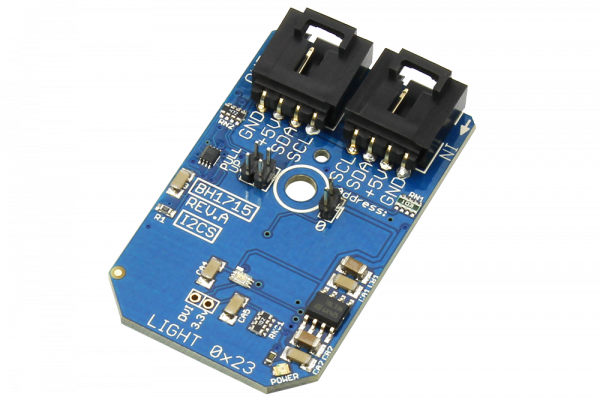

[](https://store.ncd.io/product/bh1715-digital-ambient-light-sensor-16-bit-1-to-65535-lux-i%C2%B2c-mini-module/).

# BH1715

The BH1715 is a digital Ambient Light Sensor with an I2C bus interface.The BH1715 is commonly used to obtain the ambient light data for adjusting LCD and Keypad backlight power for mobile devices.This device offers a 16-bit resolution and an adjustable measurement range, allowing detection from .23 to 100,000 lux.
This Device is available from www.ncd.io

[SKU: BH1715]

(https://store.ncd.io/product/bh1715-digital-ambient-light-sensor-16-bit-1-to-65535-lux-i%C2%B2c-mini-module/)
This Sample code can be used with Raspberry Pi.

Hardware needed to interface BH1715 Digital ambient light sensor With Raspberry Pi :

1. <a href="https://store.ncd.io/product/bh1715-digital-ambient-light-sensor-16-bit-1-to-65535-lux-i%C2%B2c-mini-module/">BH1715 digital ambient light Sensor</a>

2. <a href="https://store.ncd.io/product/i2c-shield-for-raspberry-pi-3-pi2-with-outward-facing-i2c-port-terminates-over-hdmi-port/">Raspberry Pi I2C Shield</a>

3. <a href="https://store.ncd.io/product/i%C2%B2c-cable/">I2C Cable</a>

## Python

Download and install smbus library on Raspberry pi. Steps to install smbus are provided at:

https://pypi.python.org/pypi/smbus-cffi/0.5.1

Download (or git pull) the code in pi. Run the program.

```cpp
$> python BH1715.py
```
The lib is a sample library, you will need to calibrate the sensor according to your application requirement.
